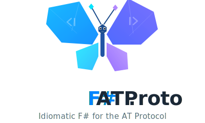

<!-- @format -->

<p align="center">
  
</p>

<p align="center">
  <a href="https://github.com/Arrow7000/atproto-fsharp/actions/workflows/ci.yml"></a>
  
  
  <a href="LICENSE"></a>
</p>

<p align="center">
  A native F# library for <a href="https://bsky.app">Bluesky</a> and the <a href="https://atproto.com">AT Protocol</a>.
  <br/>
  Built from the ground up in F#. No C# wrappers. Functional-first.
</p>

---

```fsharp
open FSharp.ATProto.Bluesky

taskResult {
    let! agent = Bluesky.login "https://bsky.social" "my-handle.bsky.social" "app-password"
    let! post = Bluesky.post agent "Hello from F#! 🦋"
    let! like = Bluesky.like agent post // PostRef -> LikeRef (the compiler prevents mix-ups)
    let! reply = Bluesky.replyTo agent "Nice thread!" post // thread root resolved automatically
    let! _ = Bluesky.undo agent like // generic undo — works on any ref type
    return reply
}
// : Task<Result<PostRef, XrpcError>> — no exceptions, ever
```

## Design

- **If it compiles, it's correct** — distinct types for every domain concept (`PostRef`, `LikeRef`, `FollowRef`, `BlockRef`...) mean the compiler catches your mistakes.
- **The library handles protocol complexity** — thread roots, rich text facets, chat proxy headers — all resolved automatically.
- **Results, not exceptions** — every public function returns `Result`. No `failwith`, no try/catch.
- **Generated from the spec** — 324 Lexicon schemas compiled to F# types + 237 typed XRPC endpoint wrappers.

## Getting Started

```fsharp
open FSharp.ATProto.Bluesky

taskResult {
    let! agent = Bluesky.login "https://bsky.social" "my-handle.bsky.social" "app-password"
    let! post = Bluesky.post agent "Hello from F#!"
    return post // PostRef — contains the AT-URI and CID of the new post
}
```

## Features

### Rich text

Mentions, links, and hashtags are detected and resolved automatically when you post:

```fsharp
let! post = Bluesky.post agent "Hey @alice.bsky.social, check https://example.com #fsharp"
```

### Images

```fsharp
let! post =
    Bluesky.postWithImages agent "Photo dump!" [
        { Data = imageBytes; MimeType = Jpeg; AltText = "A sunset over the ocean" }
    ]
```

### Social graph

```fsharp
let! followRef = Bluesky.follow agent did                    // typed Did
let! followRef = Bluesky.followByHandle agent "alice.bsky.social"  // or by handle
let! _ = Bluesky.undo agent followRef                        // generic undo
```

### Replies

```fsharp
// Thread root resolved automatically — just pass the parent
let! reply = Bluesky.replyTo agent "Great post!" parentPostRef
```

### Chat / DMs

```fsharp
// Chat proxy headers are handled automatically
let! convo = Chat.getConvoForMembers agent [ recipientDid ]
let! msg = Chat.sendMessage agent convo.Convo.Id "Hello from F#!"
```

### Identity

```fsharp
let! identity = Identity.resolveIdentity agent "alice.bsky.social"
// identity.Did, identity.Handle, identity.PdsEndpoint, identity.SigningKey
```

### Pagination

```fsharp
// Lazy, on-demand pagination via IAsyncEnumerable
let pages = Bluesky.paginateTimeline agent (Some 50L)
// Each page: Result<GetTimeline.Output, XrpcError>
```

### Full XRPC access

For anything the convenience API doesn't cover, all 237 Bluesky endpoints are available as typed wrappers:

```fsharp
// Query endpoints use .query, procedure endpoints use .call
let! feed = AppBskyFeed.GetAuthorFeed.query agent
    { Actor = "alice.bsky.social"; Cursor = None; Limit = Some 20L
      Filter = None; IncludePins = None }
```

## Architecture

Six layers, each building on the last:

```
┌─────────────────────────────────────────────┐
│  Bluesky    Rich text, identity, social     │
│             actions, chat, 237 XRPC wrappers│
├─────────────────────────────────────────────┤
│  Core       XRPC client, session auth,      │
│             rate limiting, pagination        │
├──────────────────────┬──────────────────────┤
│  CodeGen (CLI tool)  │  Lexicon             │
│  324 schemas → F#    │  Schema parser +     │
│                      │  validator           │
├──────────────────────┴──────────────────────┤
│  DRISL      CBOR encoding, CID computation  │
├─────────────────────────────────────────────┤
│  Syntax     DID, Handle, NSID, AT-URI, TID, │
│             CID, RecordKey, DateTime, etc.   │
└─────────────────────────────────────────────┘
```

## Building & Testing

Requires [.NET 10 SDK](https://dotnet.microsoft.com/download).

```bash
dotnet build
dotnet test
```

1,636 tests across six projects:

| Project                        | Tests |
| ------------------------------ | ----: |
| `FSharp.ATProto.Syntax.Tests`  |   758 |
| `FSharp.ATProto.DRISL.Tests`   |   112 |
| `FSharp.ATProto.Lexicon.Tests` |   387 |
| `FSharp.ATProto.CodeGen.Tests` |   179 |
| `FSharp.ATProto.Core.Tests`    |    50 |
| `FSharp.ATProto.Bluesky.Tests` |   150 |

## AI Transparency

This project was built with heavy use of AI coding assistants, mostly Claude Opus 4.6.

To ensure correctness the project validates against ground truth at every layer:

- **Syntax parsing** — [tested](tests/FSharp.ATProto.Syntax.Tests/) against the official [AT Protocol interop test vectors](https://github.com/bluesky-social/atproto-interop-tests) (valid and invalid inputs for DIDs, Handles, NSIDs, TIDs, AT-URIs, and more)
- **CBOR & CID** — [tested](tests/FSharp.ATProto.DRISL.Tests/InteropTests.fs) against the interop data-model fixtures (known JSON → CBOR → CID round-trips), plus [property-based tests](tests/FSharp.ATProto.DRISL.Tests/PropertyTests.fs) for encoding invariants
- **Lexicon schemas** — all 324 real lexicon files from the [official atproto repo](https://github.com/bluesky-social/atproto/tree/main/lexicons) are [parsed and validated](tests/FSharp.ATProto.Lexicon.Tests/RealLexiconTests.fs); the code generator is tested against them
- **Rich text** — [property-based tests](tests/FSharp.ATProto.Bluesky.Tests/RichTextTests.fs) verify byte-range correctness and facet ordering
- **XRPC / Bluesky** — [tested](tests/FSharp.ATProto.Bluesky.Tests/) via mock HTTP handlers that verify request construction, multi-step orchestration (e.g. thread root resolution), error handling, and domain type mapping (note: the mocks don't validate against real Bluesky API responses — that contract is covered by the generated types matching the lexicon schemas above)

All told, 1,636 tests across six projects, with zero reliance on manual testing or live API calls.

## License

MIT
